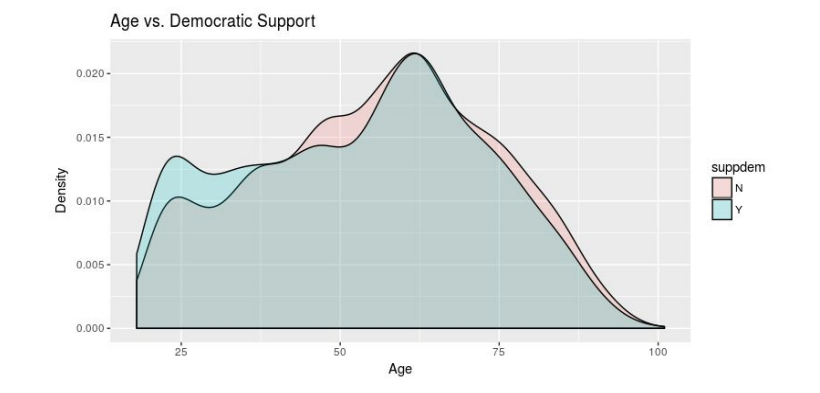
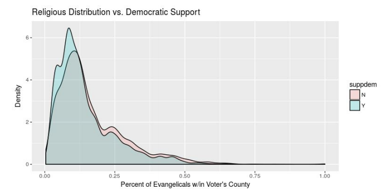
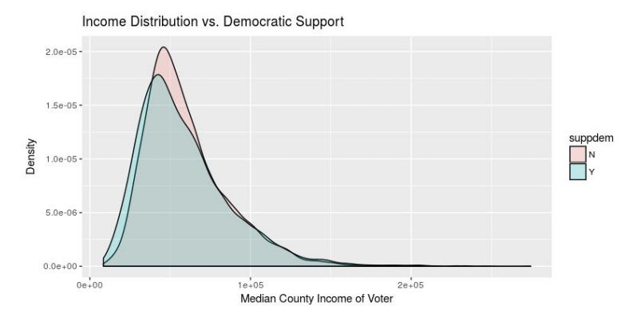
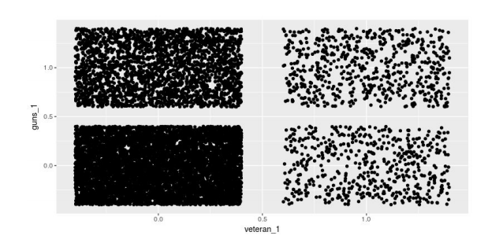

# Political Leanings in the 2016 Presidential Election - Predicting Party Preferences using a Tuned Generalized Additive Model

Project Participants: Ramtin Talebi, Richa Chaturvedi, Kartik Papatla, Mirai Shah

### Introduction

This project, part of a Kaggle competition and the final project for a course in generalized linear models, predicts whether an individual voter would support Democrats in the 2016 election using a generalized additive model.

Obtained from BlueLabs, the original dataset has 47 different variables, ranging from education level to whether or not the person in question plays golf. Submissions were ultimately judged based on log-loss predictive error on the holdout set.

### Approach

In the weeks and months leading up to the 2016 election, a number of pundits and political writers wrote off the possibility of a Trump victory due to the Trump campaign's underdeveloped voter analytics team. Following the election, however, the narrative flipped – suddenly experts agreed that it was the Democrats who had spent too much time looking at data, and not enough time talking to voters. The truth actually lies somewhere in between. Analytics can inform, not replace, political campaigns on both the national and the local level. To gain a better sense

Thus, to gain a better sense of political sentiment, our goal in this project is to predict whether an individual voter would support Democrats in the 2016 election. Obtained from BlueLabs, the original dataset has 47 different variables, ranging from education level to whether or not the person in question plays golf. Apart from the education predictor, in which 10% of its values were missing, the dataset
contains mostly complete observations. Only 5 out of these 47 variables are continuous and quantitative (ppi, median_census_income, cnty_pct_evangelical, cnty_pcy_religious), while the other 42 are categorical or binary. 

Ultimately, after performing EDA, we constructed a GAM (General Additive Model) with carefully selected main effects, tuned parameters, and significant interaction terms for our final model, yielding a log-loss score of 0.58096.


### Exploratory Data Analysis

Preliminary visualizations of the quantitative variables show some noteworthy trends.

For instance, the age distribution of voters supporting Democrats vs. the age distribution of those not supporting Democrats in the 2016 election are quite different, with younger voters tending to support Democrats over older ones.



In addition, voters living in more religious communities tended not to support Democrats while voters in less religious communities tended to support Democrats.



Lastly, it appears that individuals living in areas with lower median incomes were more likely to support Democrats.



We also visualized the relationship between pairs of predictor variables to gain a sense of the best interaction terms. For instance, although we initially assumed a majority of veterans would support guns, we found that many veterans in fact had no interest in guns.




### Code Snippets — Model Validation

```{r}
nsims=100
n.train=8000
n=nrow(train.na)
measure1=measure2=measure3=measure4=rep(NA,nsims)
for(i in 1:nsims){
  reorder=sample(n) 
  train=train.na[reorder[1:n.train],] 
  validation=train.na[reorder[(n.train+1):n],] 
  val_length = dim(validation)[1]
  
  model_final_gam = gam(suppdem ~ s(age) + sex + combined_ethnicity_4way + 
                          single + married + num_children + hasreligion + catholic + 
                          christian + interest_in_religion + donrever_1 + liberal_donor + 
                          conservative_donor + contbrel_1 + apparel_1 + boatownr_1 + 
                          cat_1 + environm_1 + outdgrdn_1 + guns_1 + s(cnty_pct_religious) + 
                          cnty_pct_evangelical + district_status + collapsed_educ + 
                          relative_income + liberal_donor*collapsed_educ +
                          combined_ethnicity_4way*catholic + sex*combined_ethnicity_4way +
                          guns_1*relative_income,
                        family = binomial, data = train, trace = FALSE)
  final_interaction_gam = gam(suppdem ~ s(age) + sex + combined_ethnicity_4way + 
                                single + married + num_children + hasreligion + catholic + 
                                christian + interest_in_religion + donrever_1 + liberal_donor + 
                                conservative_donor + contbrel_1 + apparel_1 + boatownr_1 + 
                                cat_1 + environm_1 + outdgrdn_1 + guns_1 + s(cnty_pct_religious) + 
                                cnty_pct_evangelical + district_status + collapsed_educ + 
                                relative_income + combined_ethnicity_4way*catholic +
                                num_children*relative_income + single*collapsed_educ +
                                single*collapsed_educ*s(age), 
                              family = binomial, data = train, trace = FALSE)
  model_final_gam_tuned = gam(suppdem ~ s(age) + sex + combined_ethnicity_4way + 
                                single + married + num_children + hasreligion + catholic + 
                                christian + interest_in_religion + donrever_1 + liberal_donor + 
                                conservative_donor + contbrel_1 + apparel_1 + boatownr_1 + 
                                cat_1 + environm_1 + outdgrdn_1 + guns_1 + s(cnty_pct_religious) + 
                                cnty_pct_evangelical + district_status + collapsed_educ + 
                                relative_income + liberal_donor*collapsed_educ +
                                combined_ethnicity_4way*catholic + sex*combined_ethnicity_4way +
                                guns_1*relative_income,epsilon = .001, bf.epsilon = .001,
                              family = binomial, data = train, trace = FALSE)
  final_interaction_gam_tuned = gam(suppdem ~ s(age) + sex + combined_ethnicity_4way + 
                                single + married + num_children + hasreligion + catholic + 
                                christian + interest_in_religion + donrever_1 + liberal_donor + 
                                conservative_donor + contbrel_1 + apparel_1 + boatownr_1 + 
                                cat_1 + environm_1 + outdgrdn_1 + guns_1 + s(cnty_pct_religious) + 
                                cnty_pct_evangelical + district_status + collapsed_educ + 
                                relative_income + combined_ethnicity_4way*catholic +
                                num_children*relative_income + single*collapsed_educ +
                                single*collapsed_educ*s(age), epsilon = .001, bf.epsilon = .001,
                              family = binomial, data = train, trace = FALSE)
  
  predictions1 = predict(model_final_gam, newdata = validation, type = "response")
  predictions2 = predict(final_interaction_gam, newdata = validation, type = "response")
  predictions3 = predict(model_final_gam_tuned, newdata = validation, type = "response")
  predictions4 = predict(final_interaction_gam_tuned, newdata = validation, type = "response")
  
  validation$suppdem = ifelse(validation$suppdem=="Y", 1, 0)
  measure1[i]=-1/val_length * sum(validation$suppdem * log(predictions1) +
                                    (1 - validation$suppdem) * 
                                    log(1 - predictions1))
  measure2[i]=-1/val_length * sum(validation$suppdem * log(predictions2) +
                                    (1 - validation$suppdem) * 
                                    log(1 - predictions2))
  measure3[i]=-1/val_length * sum(validation$suppdem * log(predictions3) +
                                    (1 - validation$suppdem) * 
                                    log(1 - predictions3))
  measure4[i]=-1/val_length * sum(validation$suppdem * log(predictions4) +
                                    (1 - validation$suppdem) * 
                                    log(1 - predictions4))
}
mean_model1 = mean(measure1)
mean_model2 = mean(measure2)
mean_model3 = mean(measure3)
mean_model4 = mean(measure4)
```
